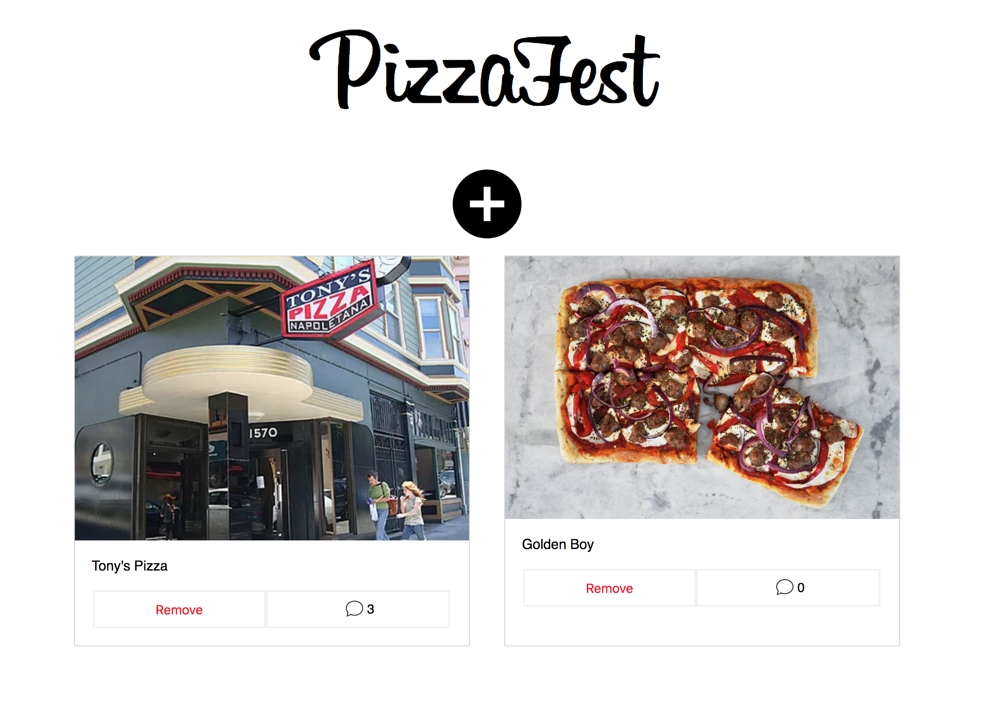

A very simple interactive single page application.

## Running
```
npm run start
```

## Notes

* This project was bootstrapped with [Create React App](https://github.com/facebookincubator/create-react-app), the most recent guide is [here](https://github.com/facebookincubator/create-react-app/blob/master/packages/react-scripts/template/README.md).
* Uses webpack for building
* Uses prettier for linting
